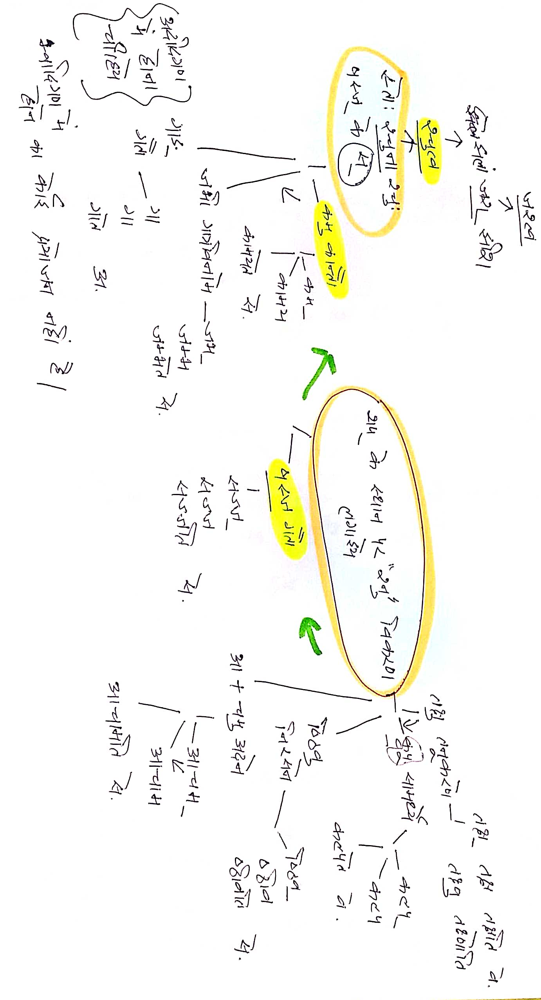

# Chapter 1

## Knowledge Process Demonstration

Notes of Ashtadhyayi Sahaj Bodh-1 Chapter-1

- Important to understand growth, collection and processing of Ashtadhyayi Sahaj Bodh-1. 
- Beauty and understanding in sync. 

### Table of Contents

### 2021-09-20

### 2021-09-21

### 2021-09-22

### 2021-09-23

### 2021-09-24

### 2021-09-25

