# Ashtadhyayi Sahajbodh 1 Mind Maps

- [ ] [Ashtadhyayi Sahajbodh Sarvdhatuk Khand](https://archive.org/details/wg849) 
- Knowledge Process Demonstration - 
    - [Chapter 1](chapter-01.md)
    - [Chapter 2](chapter-02.md)
    - [Chapter 3](chapter-03.md)
    - [Chapter 6](chapter-06.md)

## Ashtadhyayi Sahajbodh 1 Initially Factored Samples 

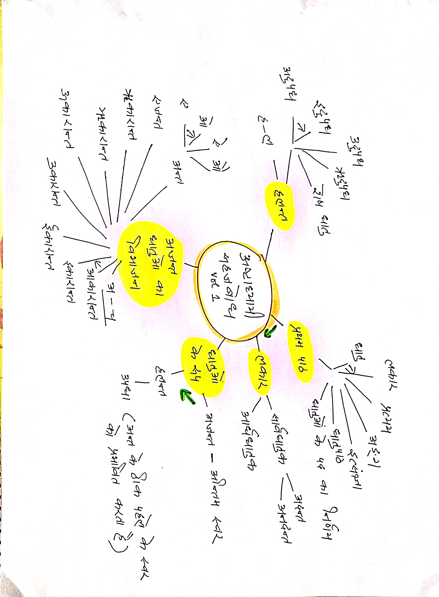

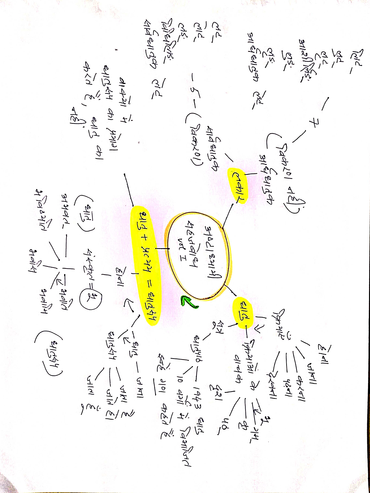

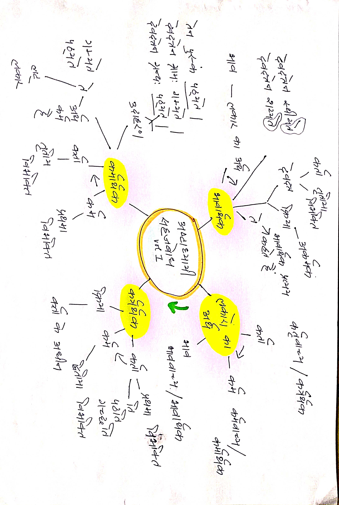

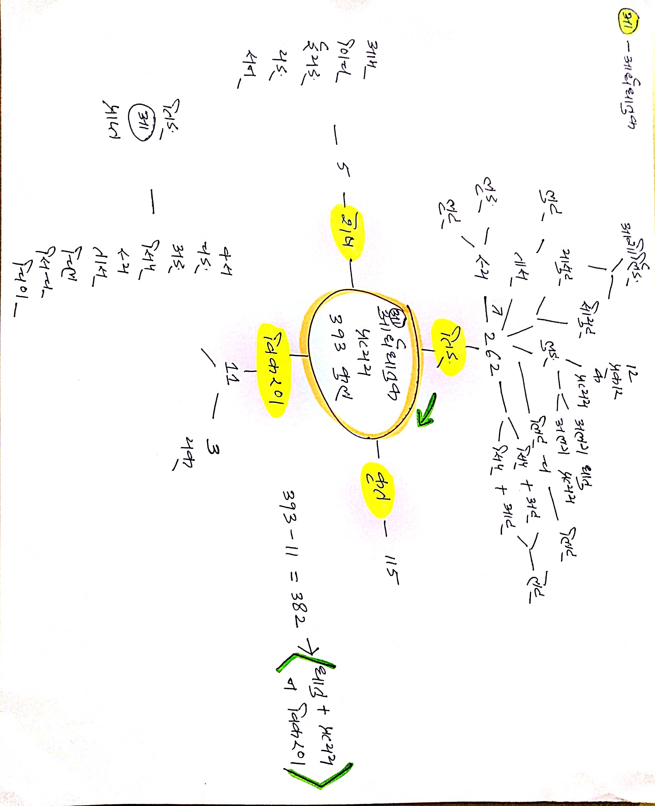

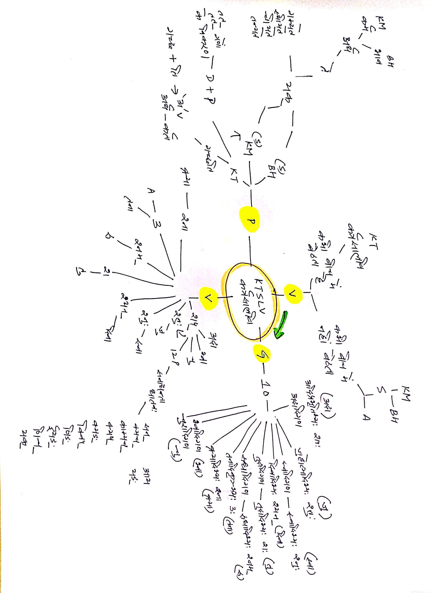

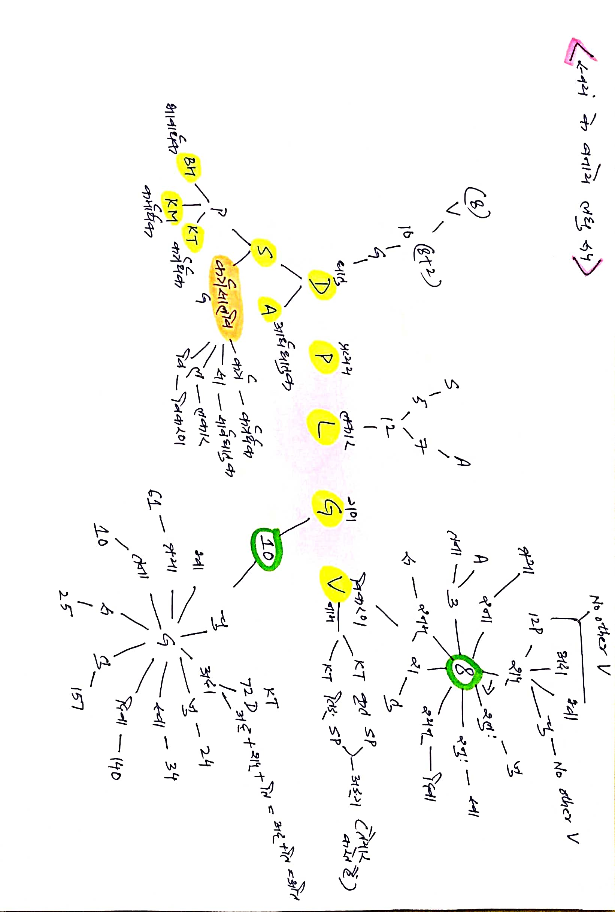

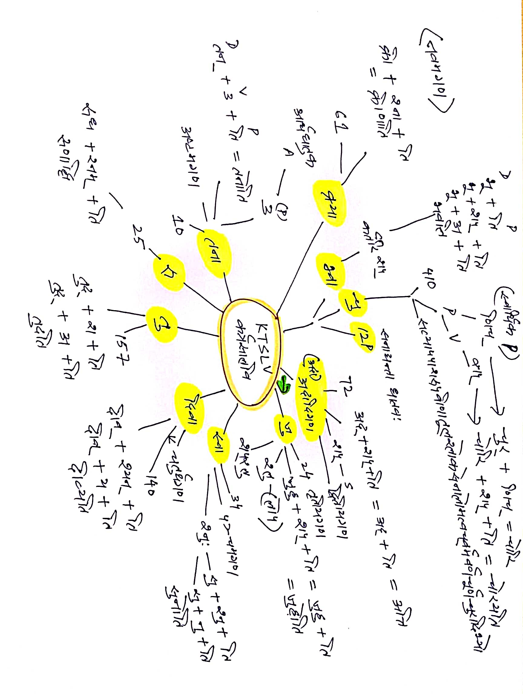

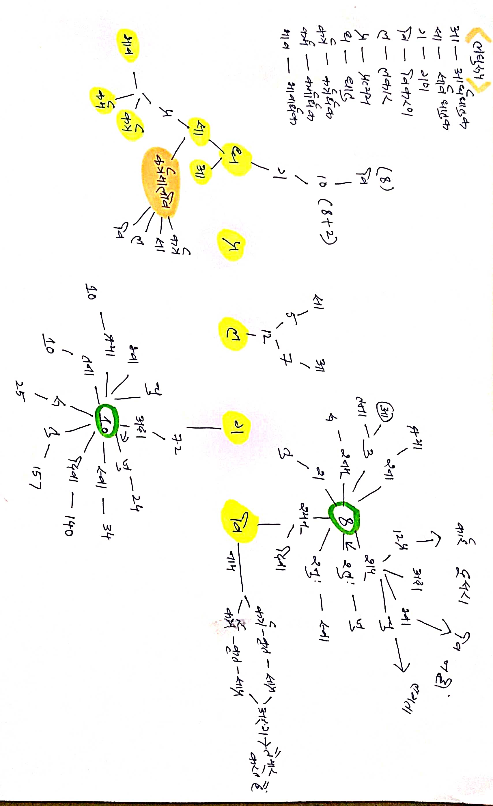

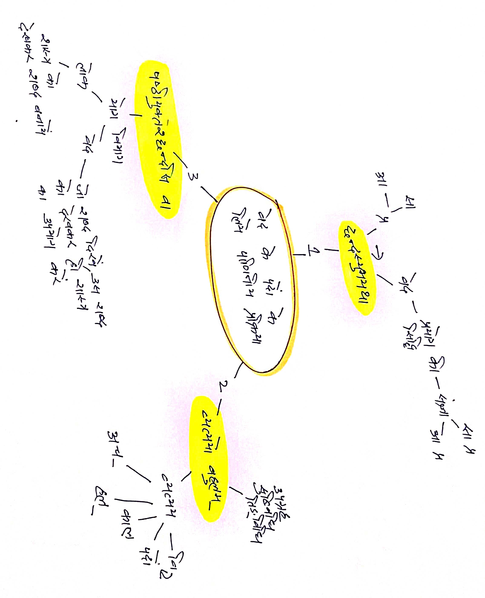

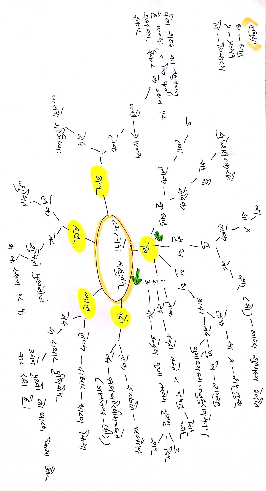

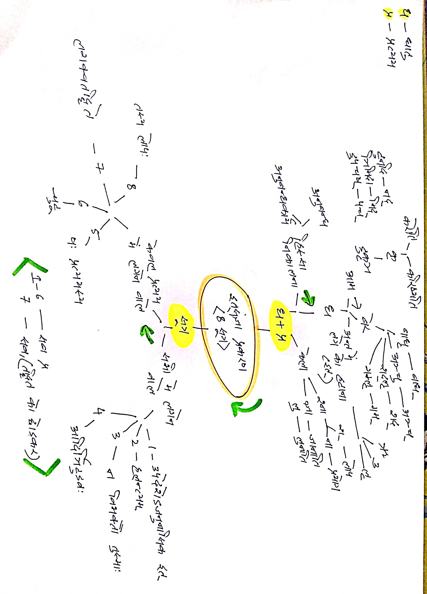

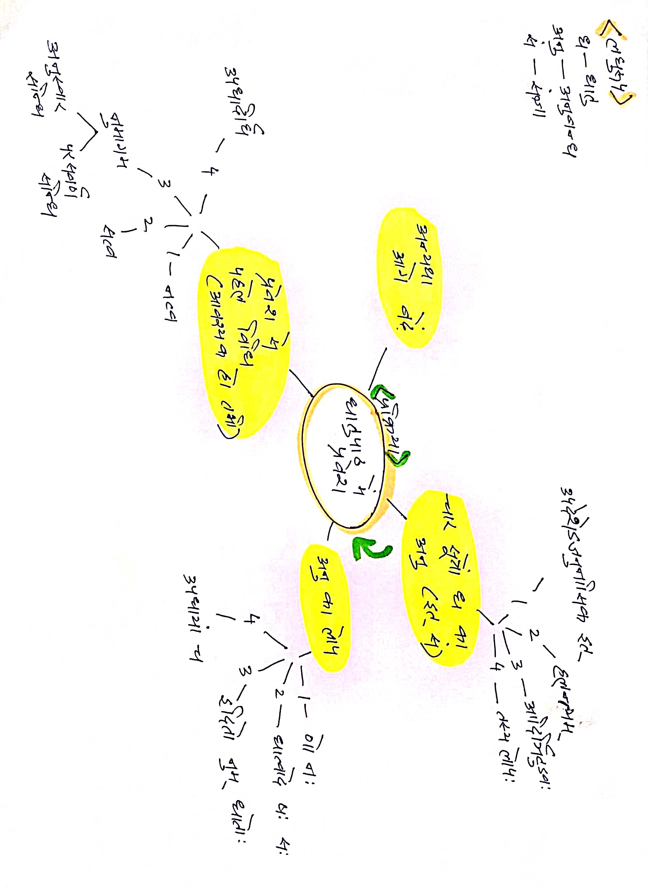

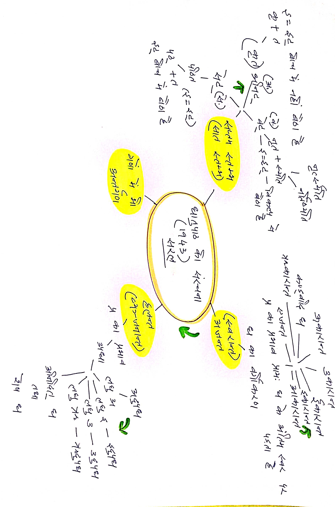

