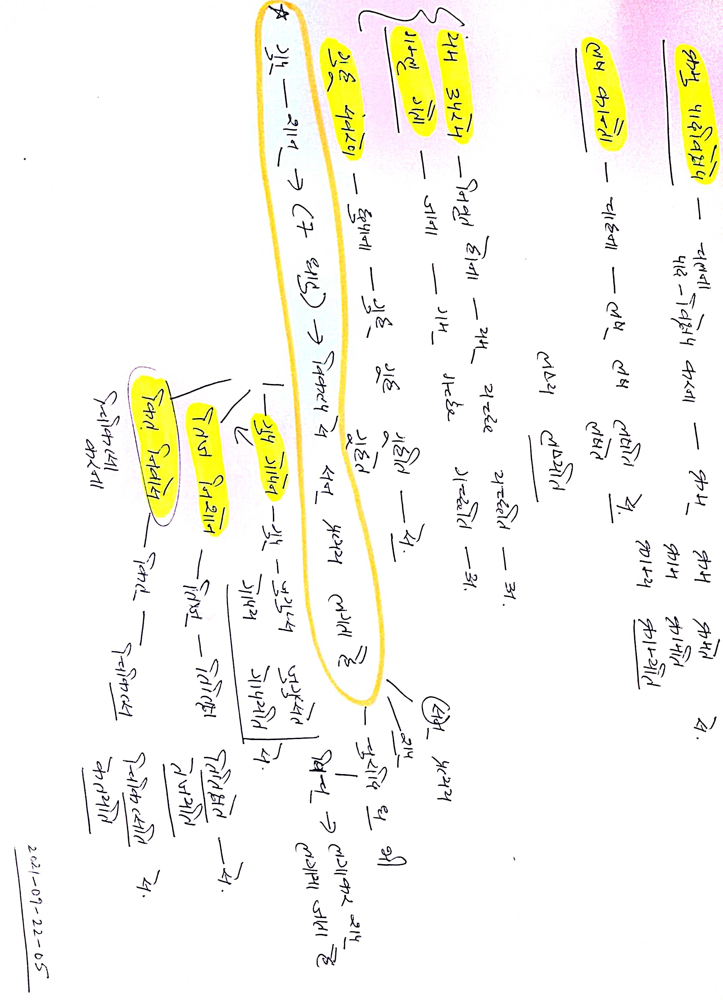
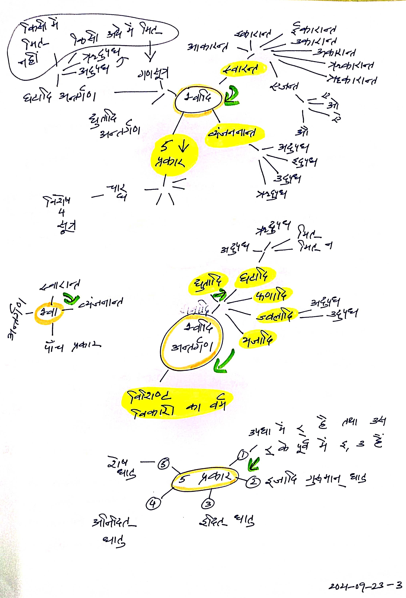
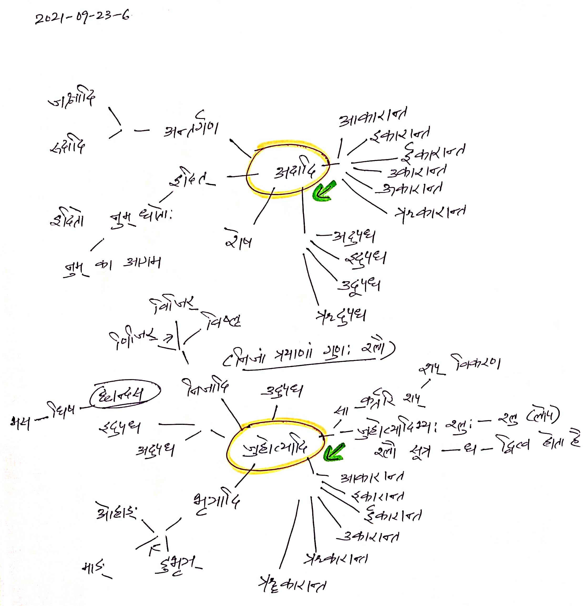

# Knowledge Process Demonstration

Working Notes of Ashtadhyayi Sahaj Bodh

- Important to understand growth, collection and processing of Ashtadhyayi Sahaj Bodh. 
- Use of Mind Mapping as analysis tool to get out the best needed result. 
- Beauty and understanding in sync. 

### 2021-09-20

### 2021-09-21

### 2021-09-22

### 2021-09-23

### 2021-09-24

